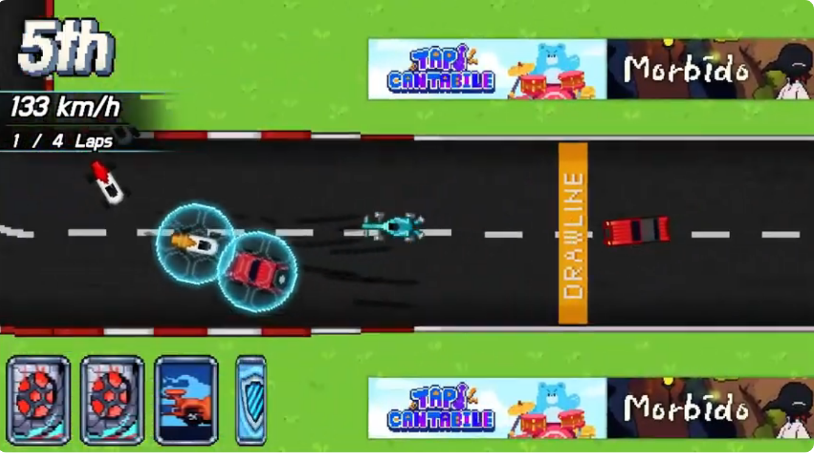
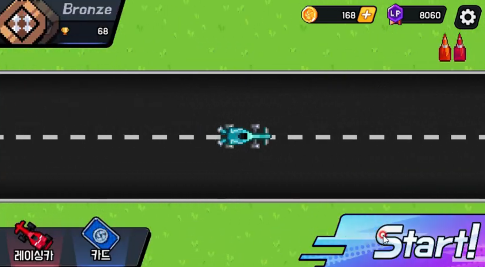
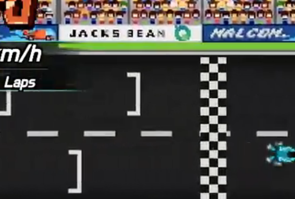

# F1 Card (F1 카드 그랑프리)

Jack's Bean 팀에서 개발한 F1 테마의 카드 게임 프로젝트입니다.

---

## 🎮 프로젝트 개요

- **엔진:** Unity
- **언어:** C#
- **장르:** 카드 게임 / 전략
- **개발 참여:** 정근녕 (클라이언트 프로그래밍)

---

## 🎬 시연 영상

<table>
  <tr>
    <td align="center">
      <a href="https://www.youtube.com/watch?v=FQD0qBco2wY"> 트레일러</a>
    </td>
    <td align="center">
      <a href="https://youtu.be/A_HSxfkOpQQ"> 시연 영상 1</a>
    </td>
    <td align="center">
      <a href="https://youtu.be/w9BJksMjOCg"> 시연 영상 2</a>
    </td>
  </tr>
</table>

---

## 📸 스크린샷

  
