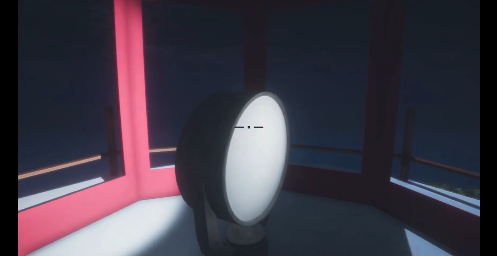
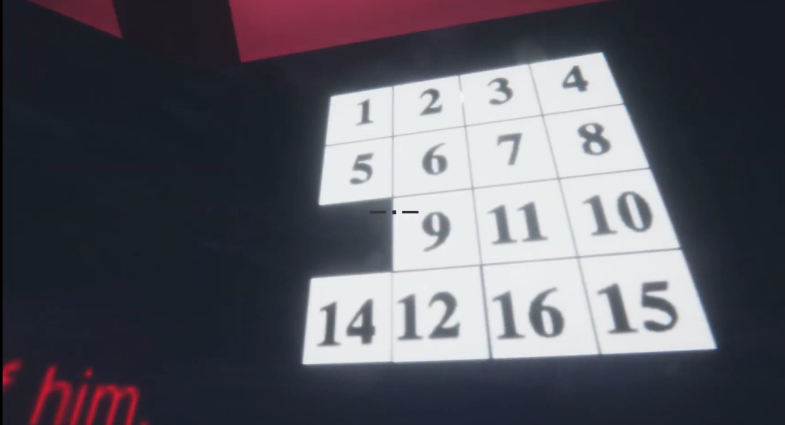
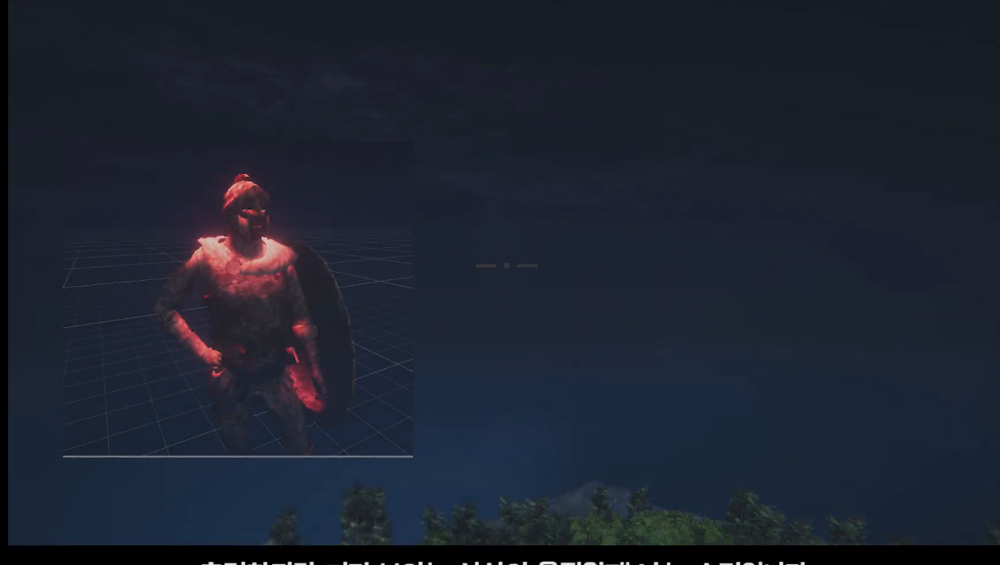

# Horror Light House

넷마블 게임아카데미 4기 지원 포트폴리오용으로 제작한 공포 퍼즐 게임입니다. (2019)

---

## 🎮 프로젝트 개요

- **엔진:** Unity
- **언어:** C#
- **장르:** 공포 / 퍼즐
- **개발 참여:** 기획 · 프로그래밍

---

## 📥 다운로드

---

## 🎬 시연 영상

---

## 📸 스크린샷

  
