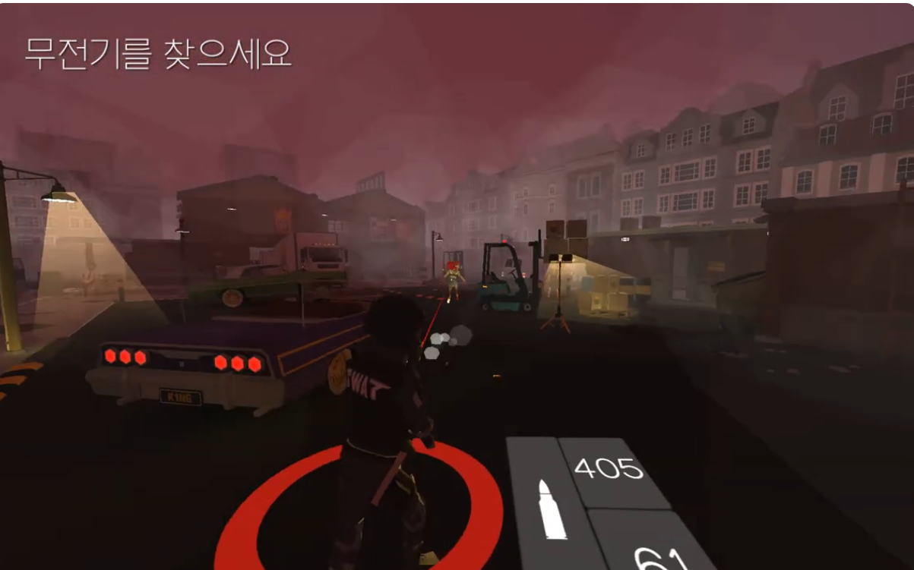
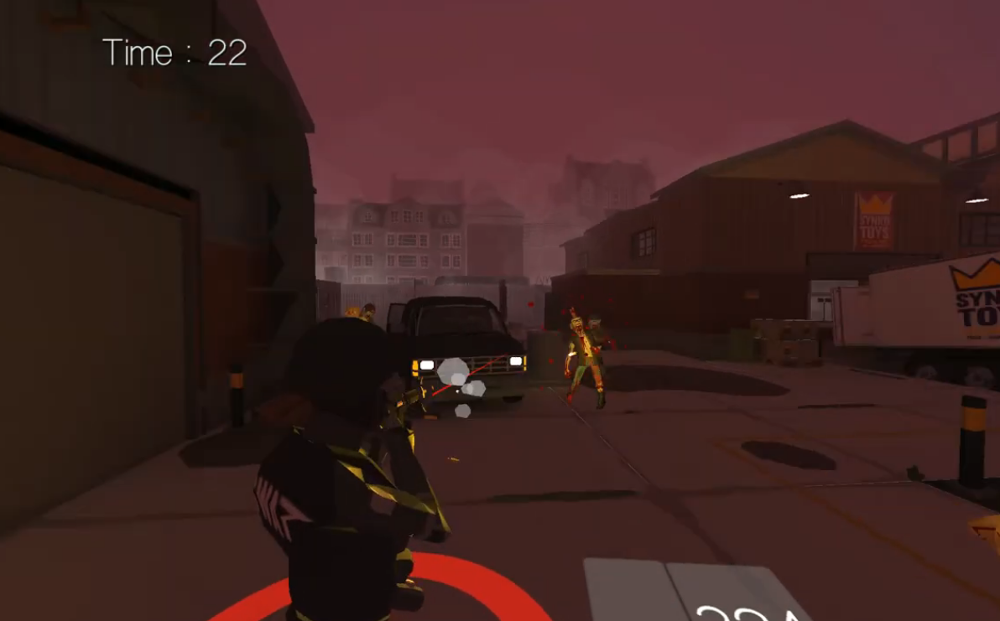
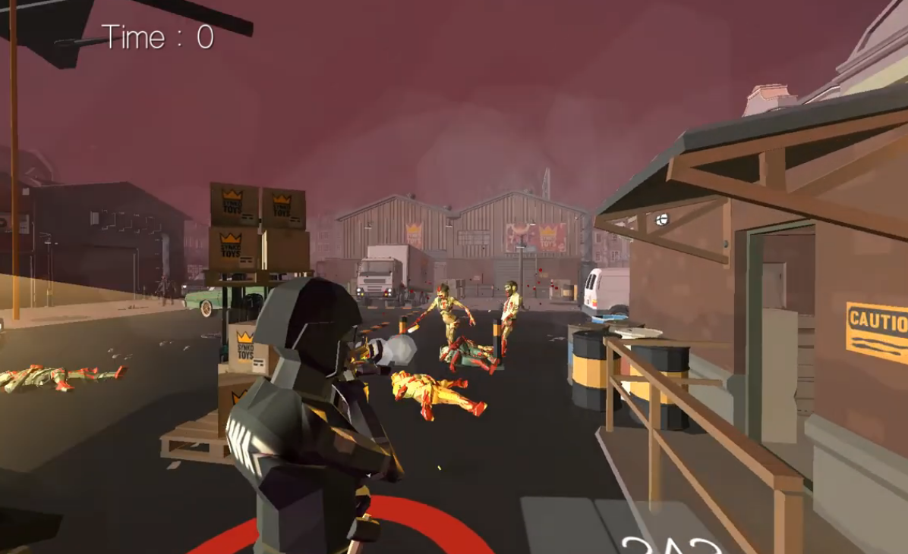

# Zombie Cadaver

고등학교 동아리 **ARTLOGIC**에서 제작한 좀비 생존 FPS/TPS 게임입니다. (2019)

---

## 🎮 프로젝트 개요

- **엔진:** Unity
- **언어:** C#
- **장르:** 좀비 생존 FPS/TPS
- **개발 참여:** 아트디자인 · 기획 · 프로그래밍

---

## 📥 다운로드

---

## 🎬 시연 영상

---

## 📸 스크린샷

  
