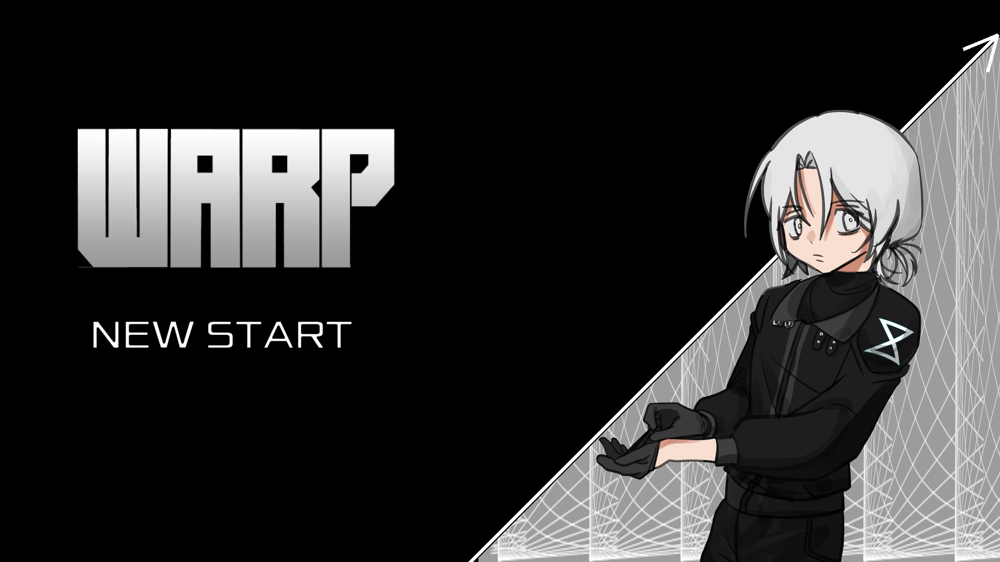
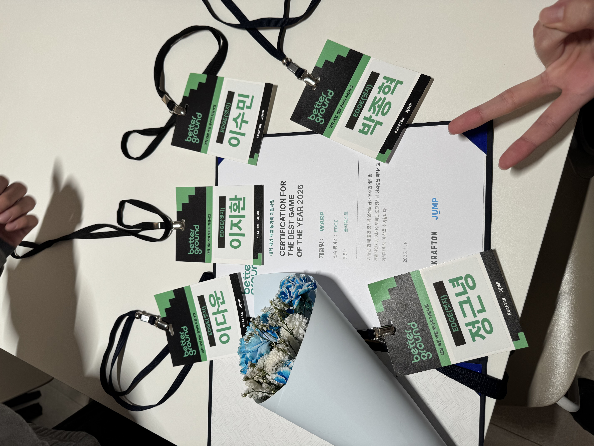
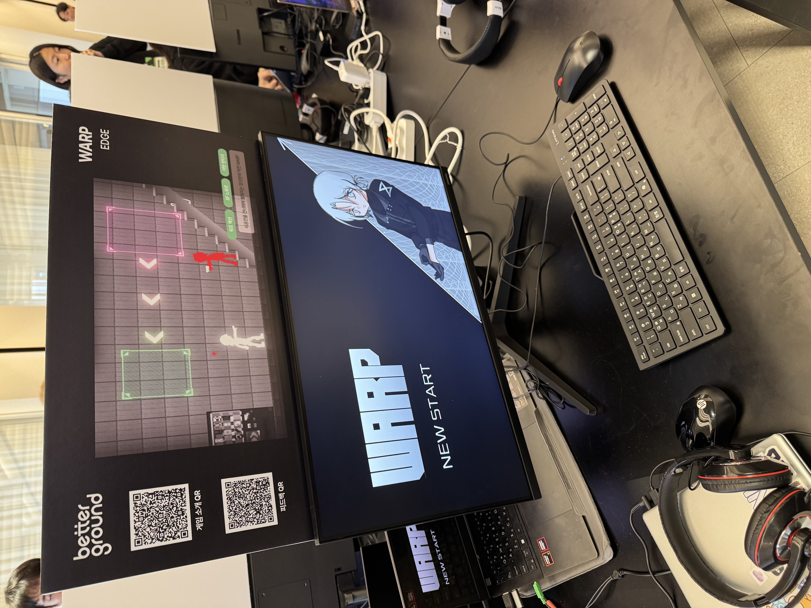
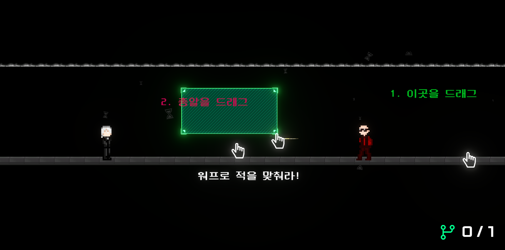
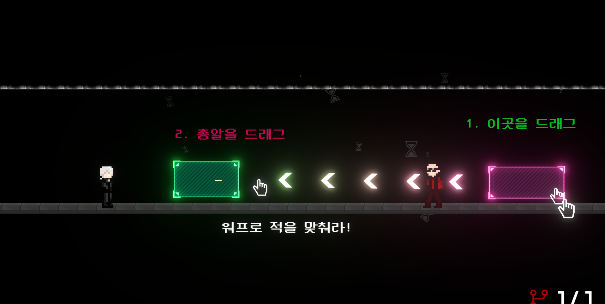
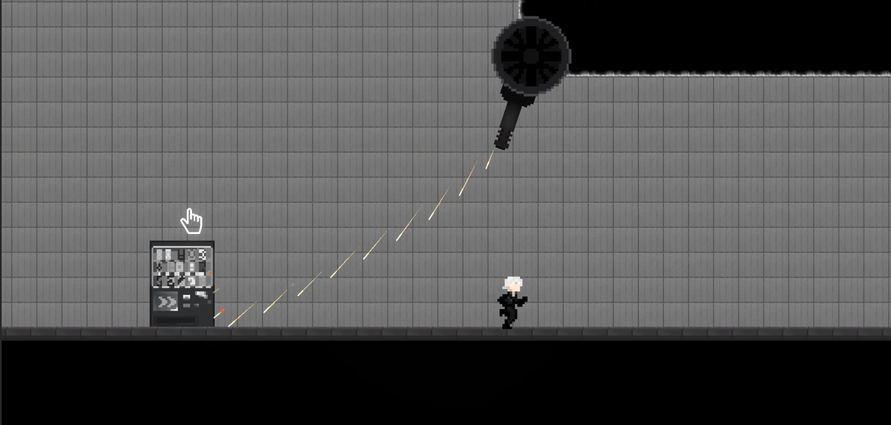
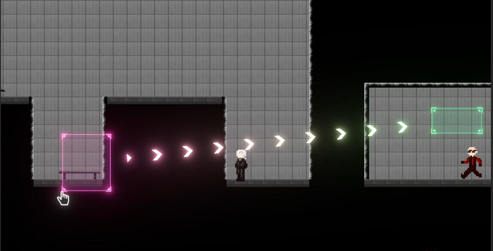
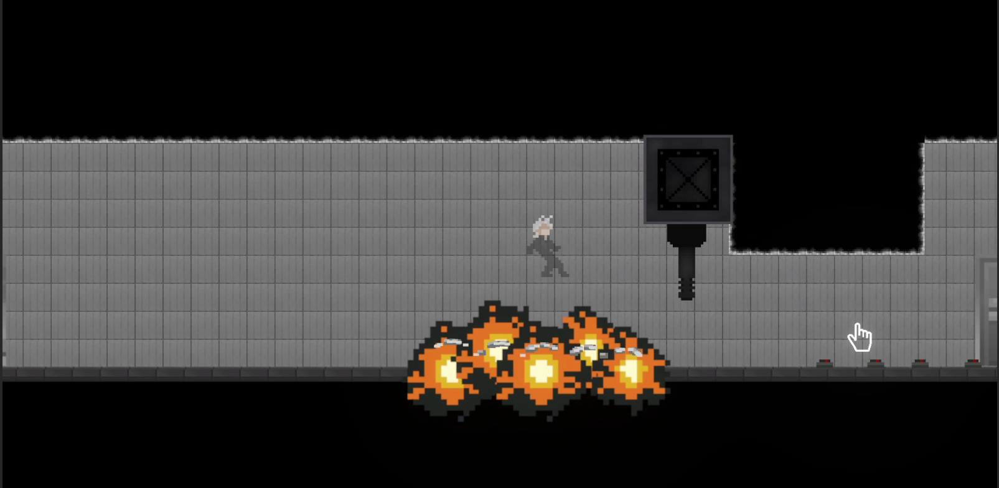
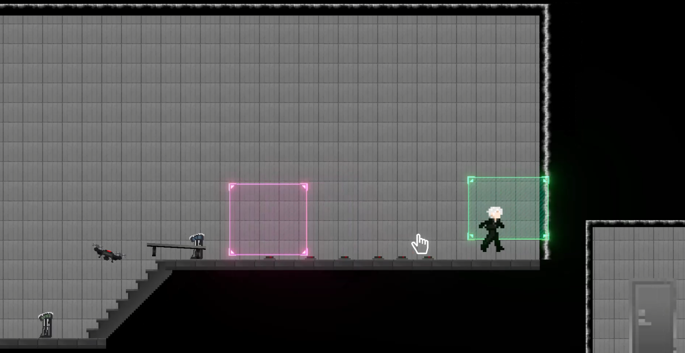
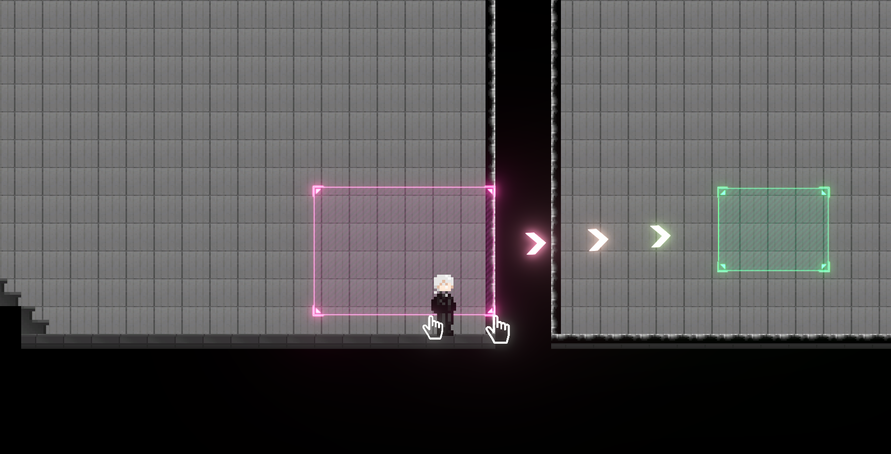

# WARP (내일은 머지)

> **PUBG Best Game of the Year 2025 🥇**

Unity 기반 2D 액션 게임 · Krafton Developer Conference 전시작

---

## 🏆 수상 및 전시

<table>
  <tr>
    <td align="center"> PUBG Best Game of the Year 2025 수상</td>
    <td align="center"> Krafton Developer Conference 전시</td>
  </tr>
</table>

---

## 📸 스크린샷

<table>
  <tr>
    <td align="center"> 인게임 사진 1</td>
    <td align="center"> 인게임 사진 2</td>
  </tr>
  <tr>
    <td align="center"> 인게임 사진 3</td>
    <td align="center"> 인게임 사진 4</td>
  </tr>
  <tr>
    <td align="center"> 인게임 사진 5</td>
    <td align="center"> 인게임 사진 6</td>
  </tr>
  <tr>
    <td align="center" colspan="2"> 인게임 사진 7</td>
  </tr>
</table>

---

## 🎮 게임 소개

드래그로 영역을 생성하고 물체를 합쳐(Merge) 적을 처치하는 액션 게임.
Warp 메커니즘을 활용해 공간을 조작하고 전략적으로 전투를 이어나간다.

[**💾 게임 다운로드 (Google Drive)**](https://drive.google.com/file/d/1Jy8m8UrZlbK8Y-mB8SJ34wQzd5KPxrp3/view?usp=drive_link)

| 항목 | 내용 |
|------|------|
| **엔진** | Unity 6000.0.42f1 |
| **플랫폼** | PC |
| **전시** | Krafton Developer Conference |
| **수상** | PUBG Best Game of the Year 2025 🥇 |

---

## 👥 팀 구성

| 이름 | 역할 |
|------|------|
| 이지환 | 기획, 개발 |
| 이다운 | PM |
| 이수민 | 개발 |
| **정근녕** | **개발 (중간 합류)** |
| 김민지 | 아트 |
| 박종혁 | 아트 |

---

## 📌 나의 기여

**참여 기간:** 2025.10 ~ 2025.11 (중간 합류)

### 1. SequenceManager — 컷씬 · 튜토리얼 시퀀스 시스템

대화(Dialog) · 카메라 전환 · 타임 어드저스트를 조합한 시퀀스 매니저를 설계·구현.
튜토리얼과 컷씬을 데이터 기반으로 재생할 수 있는 구조.

- `SequenceManager.cs` — 시퀀스 스텝 재생 · 조작 입력(WARP 제어) · 타임 제한
- `SequenceEnemy.cs` — 시퀀스 내 적 행동 제어 · 복수 적 배치 지원
- `SequenceStarter.cs` — 시퀀스 시작 트리거
- Dialog Box 9-Sprite 세팅 · Tail 추가

### 2. Enemy · Missile 개발

- `DoWarp()` 함수 선언 및 피격 처리 (Enemy / Missile 공통)
- Missile Trail 이펙트 추가
- SequenceEnemy 버그 수정 · Sequence Missile 버그 수정

### 3. GuideSetter — Warp 가이드 UI

- 플레이어가 올바른 Warp 구역에 있는지 실시간 검사하는 `GuideSetter` 구현
- Warp Guide Object 씬 적용

### 4. 버그 수정 · 안정화

- `TimeSlow` 버그 수정
- Timeline 초기화 후 카메라 Offset 미적용 버그 수정
- 출시 전 디버깅 전담

---

## 🎬 시연 영상

*이미지를 클릭하면 YouTube 시연 영상으로 이동합니다.*

